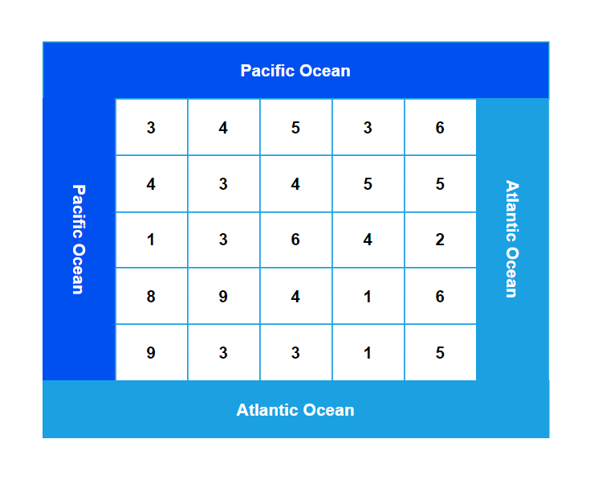

**Problem statement:**
Given a `m*n` rectangular island heights where `heights[r][c]` represents the height above sea level of the cell at coordinate `(r, c)`. The islands borders the **Pacific Ocean** from the top and left sides, and borders the **Atlantic Ocean** from the **bottom and right** sides.

The rain water in the Island can flow in four directions (up, down, left, or right) from a cell to a neighboring cell with **height equal or lower**. The water can also flow into the ocean from cells adjacent to the ocean.

Find all cells where water can flow from that cell to **both** the Pacific and Atlantic oceans. Return it as a 2D list where each element is a list **[r, c]** representing the row and column of the cell.

## Examples:
Example1:

Input: heights = [[3,4,5,3,6], [4,3,4,5,5], [1,3,6,4,2], [8,9,4,1,6], [9,3,3,1,5]]

Output: [ [ 0, 4 ], [ 1, 3 ], [ 1, 4 ], [ 2, 2 ], [ 3, 1 ], [ 4, 0 ] ]

Example2:

Input: heights = [[2],[2]]

Output: [[0,0],[1,0]]

**Algorithmic Steps**
This problem is solved by DFS using recursion. Here, the best approach to solve this problem is traversing from the outside cells into the inner cells. i.e, Recursively find the cell which can be reached by pacific and atlantic oceans. The algorithmic approach can be summarized as follows: 

1. Create a function(`pacificAtlantic`) to determine the cells which flows to both pacific and atlantic oceans. It accepts `heights` as input parameter.
   
2. Calculate the total rows and cols of given heights and store them in `rows` and `cols` variables respectively.

3. The list of cells  in which water flows in both oceans is stored in `results` array.
   
4. Create two 2D(`pacific` & `atlantic`) arrays to hold the visited cells' status for pacific and atlantic oceans.
   
5. Create a dfs function(`dfs`) to traverse each cell of the island and determine whether water can flow or not.
   1. This function accepts heights, current row, current column, visited matrix and previous height of the cell as input parameters.
   2. Return immediately either if the cell co-ordinates are not with in island boundaries or already visited or the current height is less than previous height.
   3. Recursively invoke dfs function in all the four directions(top, bottom, left and right) of the current cell.
   
6. Visit first and last row of the island cells by invoking the dfs function. This is because the water flow can reach those cells by the oceans.
   
7. Visit first and last column of the island cells by invoking the dfs function. This is because the water flow can reach those cells by the oceans.

8. Iterate over each cell and add the co-ordinates of cells which are visited by both oceans.
   
9.  Return `result` as list of cells from which water can flow to both oceans.

**Time and Space complexity:**
This algorithm has a time complexity of `O(rows * cols)`, where `rows` is the number of rows in in the island and `cols` is the number of columns in the island. This is because each cell is visited exactly once during the dfs traversal.

The `canFinish1` function requires `O(rows * cols)` space complexity, where `rows` is the number of rows in in the island and `cols` is the number of columns in the island. This is because visit matrix related to pacific and atlantic oceans requires space complexity of `O(rows * cols)`. 
