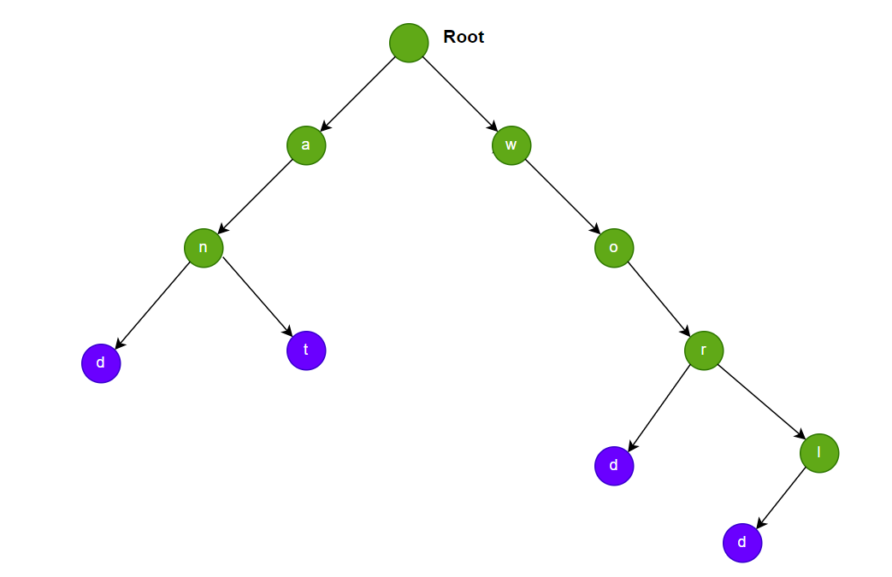

**Problem statement:**
A Trie (also known as a prefix tree) is a tree data structure used to efficiently store and retrieve keys in a set of strings. Some of the common applications of this data structure are auto-complete, spell checker systems etc.

Implement the Trie class with below steps:

1. `Trie()` Initializes the trie object.
2. `void insert(String word)` Inserts the string `word` into the trie.
3. `boolean search(String word)` Returns `true` if the string `word` is in the trie (i.e., was inserted before), and `false` otherwise.
4. `boolean startsWith(String prefix)` Returns `true` if there is a previously inserted string `word` that has the prefix `prefix`, and `false` otherwise.

## Examples:
Example1:

Input: ["Trie", "insert", "mango", "search", "mango", "search", "man", "startsWith", "man", "insert", "word", "insert", "world",,"search", "word"]

Output:
[null, null, true, false, true, null, null,true]

**Algorithmic Steps**
This problem is solved with the help of iteration over words. The algorithmic approach can be summarized as follows: 

1. Create a node class with properties(`children`) such as children map and boolean to indicate end of word(`isEndOfWord`) or not.By default, the boolean property assigned with false.

2. Create a trie datastructure class with `root` node as its property. This class has 3 major functionalities, like insert, search and lookup for prefixes.
   
3. The insert function(`insert`) accepts the given string(`word`) as input parameter.
   1. At first, assign a current node pointing to root node because the traversal starts from root node.
   2. Iterate over each character in the word and verify if that character exists or not. If not exists, create a new node with the character as a key.
   3. If the character exists, move the pointer to next character in the word.
   4. At the end, update the end of word(`isEndOfWord`) boolean flag to true.

4. The search function(`search`) accepts the given string(`word`) as input parameter.
   1. At first, assign a current node pointing to root node because the traversal starts from root node.
   2. Iterate over each character in the word and verify if that character exists or not. If not exists, return `false` indicating that the word doesn't exist.
   3. If the character exists, move the pointer to next character in the word.
   4. At the end, return `isEndOfWord` indicating search is successful or not.   
   
5. The prefix search function(`startsWith`) accepts the given prefix(`prefix`) as input parameter.
   1. At first, assign a current node pointing to root node because the traversal starts from root node.
   2. Iterate over each character in the word and verify if that character exists or not. If not exists, return `false` indicating that the word doesn't exist.
   3. If the character exists, move the pointer to next character in the word.
   4. At the end, return `true` indicating that prefix search is successful.  

**Time and Space complexity:**
Each function in this algorithm takes a time complexity of `O(n)`, where `n` is the number of characters in the given word or prefix. This is because we need to iterate through each character of the word/prefix and perform constant time operations lookup or insertion.  

The overall space complexity of the Trie data structure is `O(m * n)`, where `m` is the maximum number of children (26 English alphabet) and `n` is the average length of the word. This is required to store all those characters in a trie structure.
