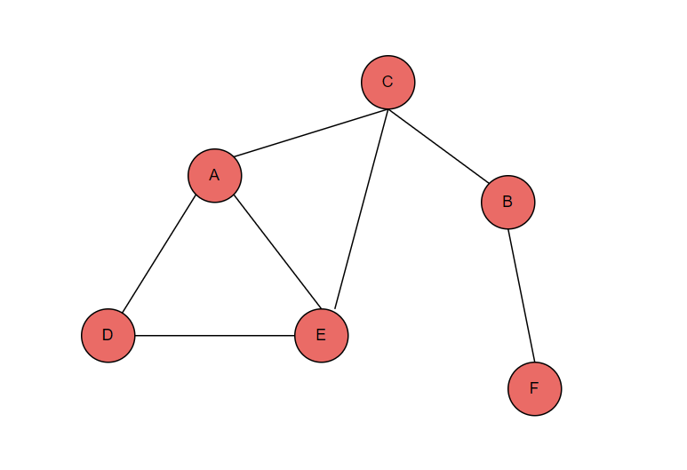

Graphs are non-linear data structures made up of a finite number of nodes or vertices and the edges that connect them. They provide us different paths to get from one vertex to another, unlike with linear data structures like Arrays, Linked Lists etc. Graphs are used to solve real-word problems where the data consists of objects and relationships between them. Some of the examples are social networks, telephone networks, circuit networks, maps and navigations, internet, neural networks etc.

The structure of graph looks like below,

   

### Types of Graphs:

1. **Undirected:** A graph in which all the edges are bi-directional without pointing in any specific direction.
2. **Directed:**   A graph in which all the edges are uni-directional where the edges point in a single direction only.
3. **Weighted Graph:** A graph in which a value or weight associated with every edge. They usually represent quantities such as cost, distance, and time, depending on the usecase.
4. **Unweighted Graph:** A graph in which no value or weight associated with the edge. By default, all the graphs are unweighted.
5. **Cyclic Graph:** A cyclic graph with one or more cycles or closed paths. That means, you can traverse the graph and follow a path such that you end up where you started.
   
6. **Acyclic Graph or Directed Acyclic Graph(DAG):** A graph with no directed cycles.
7. **Connected graph:** A graph which has a path between every pair of nodes.
8. **Unconnected graph:** A graph which has atleast one pair of nodes without path between them.
9. **Complete Graph:** A graph where it has edge between every pair of nodes.

The tree can have the following functionalities,

1. **Add vertex:** This method is used to add a new vertex to the adjacency list(i.e, edges) if the node didn't exist already. Also, the number of vertices counter increased for each insertion. At the end, it returns `true` for successful insertion, otherwise returns `false` 
   
2. **Add edge:** This method is helpful to add an edge between two existing vertex in the graph. If any vertex doesn't exist, it will be return the status as `false`.
   
3. **Remove edge:**: This method is used to remove an edge which already established between given two nodes. If any vertex doesn't exist, it will be return the status as `false`.
   
4. **Remove vertex**: In this method, the edges formed with given node needs to be removed first. Thereafter, the vertex is removed and the number of vertices count decreased by 1.
   
5. **Show all connections:** This is a utility formatting method which is used to traverse and display all the vertices and their edges with in a graph. 

   